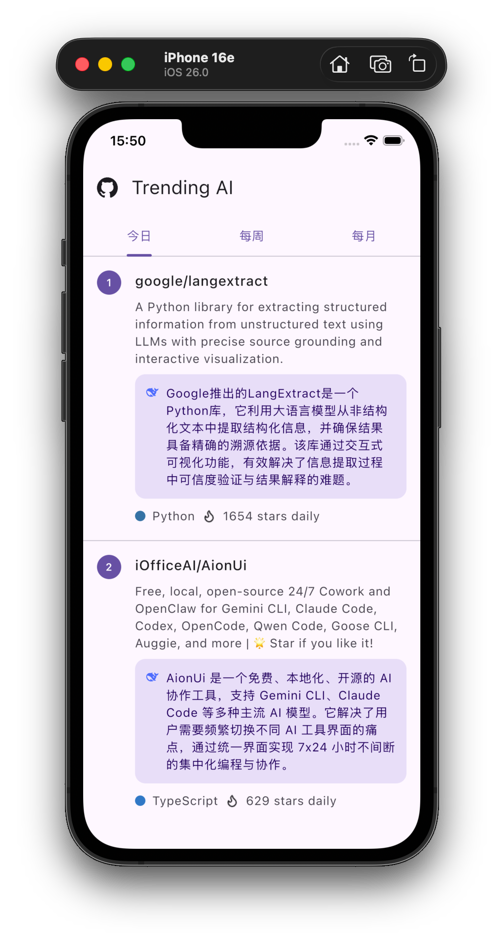

# Trending AI

**「 洞察趋势，AI 领航 」**  
*聚合 GitHub Trending 热门仓库，通过 AI 摘要技术，让核心价值触手可及。*

---

### 🌟 项目简介

**Trending AI** 是一款基于 **Kotlin Multiplatform (KMP)** 开发的跨平台移动应用，致力于为开发者提供极致的 GitHub Trending 仓库探索体验。

我们深知在信息爆炸的开源世界中，快速定位高价值项目的重要性。因此，该应用不仅展示 GitHub 每日、每周及每月的 Trending 热门仓库榜单，更深度集成了 **Gemini** 与 **DeepSeek** 等模型，为每个仓库生成精炼的 **AI 摘要速览**。无需深入阅读代码库，即可快速洞察项目核心逻辑。

---

### 📥 立即下载

您可以在 GitHub 获取最新的安装包：

- **Android**: 
- **iOS**: 🚀 *Coming Soon*

---

## ✨ 核心功能

- 🚀 **GitHub 热门榜单**：支持查看“今日”、“每周”和“每月”的 AI 相关热门项目。
- 🤖 **AI 智能摘要**：集成 Gemini 和 DeepSeek 模型，自动生成项目的中文核心解读。
- 📱 **原生跨平台体验**：采用 Compose Multiplatform 构建，一套代码同时运行在 Android 和 iOS 平台。
- 🎨 **Material 3 设计**：遵循 Google 最新 Material Design 3 规范，提供流畅的视觉交互。

## 📸 界面预览

| Android 预览 | iOS 预览 |
| :---: | :---: |
|  |  |

## 🛠️ 技术栈

- **核心架构**: [Kotlin Multiplatform (KMP)](https://kotlinlang.org/docs/multiplatform.html)
- **UI 框架**: [Compose Multiplatform](https://www.jetbrains.com/lp/compose-multiplatform/)
- **网络库**: [Ktor Client](https://ktor.io/)
- **序列化**: [Kotlinx Serialization](https://github.com/Kotlin/kotlinx.serialization)
- **UI 组件**: Material 3 (Expressive API)

## 📂 项目结构
- `shared`: 核心逻辑模块，包含 UI (Compose)、API 请求、数据模型等。
- `androidApp`: Android 原生入口。
- `iosApp`: iOS 原生入口（SwiftUI 包装）。
