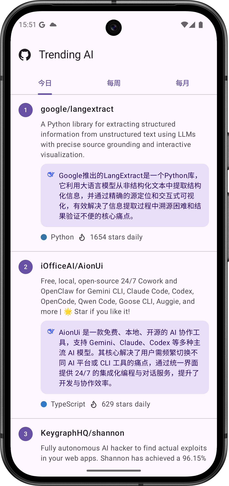

# Trending AI

> 🚧 **当前状态：项目积极开发中 (Work in Progress)**

**用 AI 快速读懂 GitHub Trending 开源项目。**

*帮你省去翻阅冗长 README 和源码的时间，高效过滤并定位高价值的开源代码。*

---

## 📖 项目简介

Trending AI 是一款使用 Kotlin Multiplatform (KMP) 构建的跨平台应用。它不仅能让你随时查看 GitHub 的每日、每周、每月热门仓库榜单，还会通过接入的大语言模型，自动为每个项目生成一句话精炼摘要。

## ✨ 核心功能

- 📈 **全方位趋势**：实时查看 GitHub 今日、本周、本月的热门项目榜单。
- 🤖 **AI 智能摘要**：集成 Gemini / DeepSeek 模型，为每个仓库自动提炼核心功能与逻辑。
- 📅 **历史回溯**：支持按日期与批次（早报/晚报）查询往期榜单数据。
- 📱 **原生跨平台**：采用 Compose Multiplatform 构建，一套代码同时覆盖 Android 与 iOS。

---

## 📸 界面预览

---

## 📥 下载体验

目前处于早期预览阶段：

- **Android**: 
- **iOS**: *Coming Soon*

---

## 🛠️ 技术栈

**Kotlin Multiplatform** | **Compose Multiplatform** | **Ktor** | **Material 3**

---

## 📚 文档

- [项目技术架构文档](docs/ARCHITECTURE.md)
- [图标制作与适配指南](docs/ICON_GUIDE.md)
